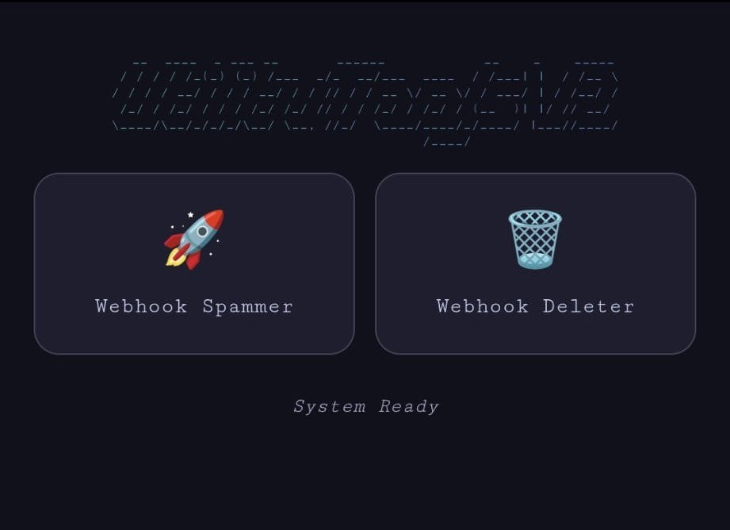

<p align="center">
  
</p>

<h1 align="center">UtilityTools V2</h1>

<p align="center">
  <b>Android utility app powered by Python & WebView</b><br>
  <i>Modular · Auto-updating · Lightweight · Open source</i>
</p>

<p align="center">
  <a href="#features">Features</a> •
  <a href="#quick-start">Quick Start</a> •
  <a href="#tools">Tools</a> •
  <a href="#development">Development</a>
</p>

---

## 🚀 Features

- **Modular Tool System** - Tools load dynamically from GitHub, no rebuild needed to add new ones.
- **Auto-Update** - App checks GitHub Releases on launch and prompts to install new versions.
- **External UI** - Home screen is fetched from GitHub, allowing live UI changes without rebuilding.
- **Local Caching** - Tools are cached with version tracking, only re-downloaded when updated.
- **pywebview Bridge** - Native Android WebView with Python backend via JS API bridge.
- **Bottle Server** - Local HTTP server serves tool assets to the WebView seamlessly.

---

## 🛠️ Quick Start

### 1. Download
Grab the latest APK from the [Releases](../../releases/latest) page.

### 2. Install
Enable **Install from unknown sources** in your Android settings, then install the APK.

### 3. Launch
Open the app — tools are fetched automatically on first launch.

---

## 🧰 Tools

| Tool | Description |
|------|-------------|
| Webhook Deleter | Delete a Discord webhook by URL |
| Webhook Spammer | Spams a webhook,for more details click [here](https://github.com/xritura01/UtilitoolsV2-Webhook)|

> More tools are added via GitHub — no app update required.

---

## ⚙️ Development

### Requirements

- Python 3.x
- Buildozer
- WSL / Linux

### Build from Source
```bash
git clone https://github.com/rhuda21/utilitytools-Android.git
cd utilitytools-Android
buildozer android debug
```

### Adding a Tool

1. Create a folder `Tools/YourTool/` with `index.html` and `logic.py`
2. Add an entry to `Tools.json`
3. Push to GitHub — the app picks it up automatically on next launch

---

## 📁 Project Structure
